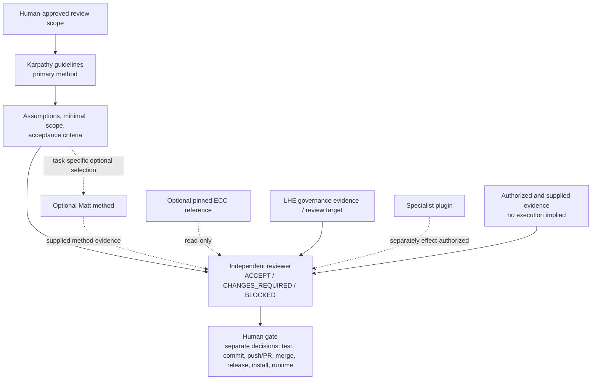

# Independent LHE Upgrade Review Checklist

## Status

```text
design_status: PROPOSAL_ONLY
implementation_authorized: false
test_execution_authorized: false
additional_file_creation_authorized: false
additional_repository_changes_authorized: false
external_action_authorized: NONE
```

This is a static task card for an independently reviewed LHE upgrade. It is
not a skill router, runtime policy engine, grant, installation record, command
runner, Hook, MCP configuration, memory configuration, or source of merge,
release, installation, or execution authority.

## Roles and authority

```text
review_conclusion_owner: INDEPENDENT_REVIEWER
external_action_authority: HUMAN_GATE

primary_engineering_method: KARPATHY_GUIDELINES
matt_role: OPTIONAL_TASK_SPECIFIC_METHODS
automatic_method_pipeline: FORBIDDEN

lhe_role: REVIEW_TARGET_AND_AUXILIARY_GOVERNANCE_EVIDENCE
ecc_role: OPTIONAL_PINNED_READ_ONLY_REFERENCE
```

The independent reviewer may conclude only `ACCEPT`, `CHANGES_REQUIRED`, or
`BLOCKED`. A conclusion is evidence for a later human decision, not action
authority:

```text
ACCEPT != COMMIT_AUTHORIZED
ACCEPT != PUSH_PR_AUTHORIZED
ACCEPT != MERGE_AUTHORIZED
ACCEPT != RELEASE_AUTHORIZED
ACCEPT != INSTALLATION_AUTHORIZED
ACCEPT != RUNTIME_EFFECT_AUTHORIZED
CI_SUCCESS != EXECUTION_OR_HUMAN_AUTHORIZATION
SIGNATURE_VERIFIED != EXECUTION_OR_HUMAN_AUTHORIZATION
```

CI success is automated-check evidence. Signature verification establishes the
integrity and signer attribution of the verified Git object. Neither establishes
independent review approval, human action authority, execution, merge, release,
or installation authority.

Karpathy guidelines are the primary method for assumptions, simplicity,
surgical scope, and verifiable goals. Matt methods are optional,
task-specific aids only when Karpathy-led scope analysis identifies a material
gap they help close. An unselected Matt method requires no `NO_APPLICABLE_METHOD`
record. Selecting a Matt method does not activate any other Matt method or
imply an implementation, Issue, Hook, sub-agent, network, or write effect.

LHE checks provide contract or validation evidence only:

```text
lhe_contract_validation != host_enforcement
lhe_report != independent_review
lhe_gate_result != human_authorization
```

## Capability facts are orthogonal

Do not represent capability status as an automatic lifecycle. Record each fact
with its scope and evidence:

```yaml
capability_id: "<method-or-tool-id>"
catalogued: false

source:
  verified: false
  commit: null
  tree: null
  path: null
  license: null
  content_digest: null

project_presence:
  source_project_installed: false
  target_project_installed: false

host:
  method_exposure: NOT_PROVEN
  full_workflow_callable: NOT_PROVEN

task_effect_authorization:
  status: NOT_GRANTED
  task_id: null
  allowed_effects: []
  forbidden_effects: []
  source_scope: []
  expires_at: null
  reusable: false

execution:
  status: NOT_EXECUTED
  observed_effects: []
```

```text
state_dimensions: ORTHOGONAL
automatic_promotion: FORBIDDEN
source_verified != safe
source_project_installed != target_project_installed
target_project_installed != callable
callable != task_effect_authorized
task_effect_authorized != executed
previous_execution != current_authorization
```

The fields above are review disclosures, not a runtime Task Grant protocol.
They do not issue, validate, cache, or consume authorization.

## Current-source reporting rules

For ECC and Matt, distinguish source presence from host or target-project use.
Until all facts are rechecked from an exact path and immutable identity, report
them as `NOT_PROVEN` or `TO_BE_VERIFIED`; a claimed version or skill count is
not current-source evidence by itself.

For a Matt method held in a separate isolated project, report at minimum:

```text
source_project_present: <PROVEN | NOT_PROVEN>
target_project_installed: <true | false | NOT_PROVEN>
host_method_exposure: <DECLARED | NOT_PROVEN>
read_only_instruction_use: <NOT_USED | OBSERVED>
mutating_flow_authorized: false
```

For ECC, separately report source, project installation, host registration,
callability, task-scoped authorization, and execution. Do not use
`ecc_runtime: NOT_ENABLED` as a substitute for these facts.

## Per-task task card

Keep a completed card to task-specific decisions only. It must not replicate
the full contents of a Skill, maintain a global registry, route skills,
auto-load sources, or configure Hooks, MCP, memory, or background work.

```yaml
target: "<repository-or-artifact>"
fixed_base: "<immutable commit-or-tree>"
requested_outcome: "<bounded outcome>"
in_scope: []
out_of_scope: []

primary_method: KARPATHY_GUIDELINES
optional_task_methods: []
optional_method_selection_result: NOT_EVALUATED
optional_ecc_reference: null

allowed_effects: []
forbidden_effects:
  - network
  - write
  - install
  - hook_creation
  - mcp_registration
  - external_action

lhe_checks: []
independent_review_points: []
stop_conditions: []

review_conclusion: PENDING
human_disposition: PENDING
commit_authorized: false
push_pr_authorized: false
merge_authorized: false
release_authorized: false
installation_authorized: false
runtime_effect_authorized: false
```

### Candidate commands

A candidate command is a proposal, never an execution instruction. Before it
can run, inspect its definition and dependencies in the declared working
directory, then obtain a separate effect-scoped authorization.

```yaml
command: "<proposed command>"
proposal_only: true
execution_authorized: false

working_directory:
  value: "<required cwd>"
  verified: false

expected_writes:
  status: UNKNOWN
  paths: []

network_behavior:
  status: UNKNOWN

dependency_behavior:
  status: UNKNOWN

cleanup:
  required: UNKNOWN
  proposed_paths: []

inspection_required_before_execution: true
```

`VERIFIED_NONE` is permitted only after an explicit inspection has accounted
for repository writes, temporary files, caches, coverage, snapshots, build
artifacts, and user-directory effects.

## Review flow



No arrow authorizes a later activity. Implementation and test evidence may be
reviewed only when it was separately authorized and actually supplied.

## Fixed exclusions

This design does not authorize:

- installation or bulk synchronization of ECC or Matt sources;
- a Hook, MCP, memory, background task, automatic Skill loading, or global
  configuration;
- test execution, dependency installation, source fetching, network access, or
  execution of candidate commands;
- repository writes outside this design artifact, commit, push, pull request,
  merge, tag, release, installation, or runtime behavior;
- financial data access, account or credential access, trading, or external
  action.
